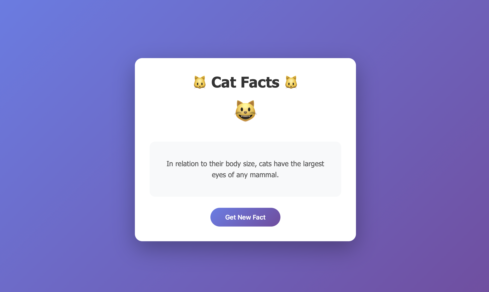

# 🐱 Cat Facts Generator

A simple web application that displays random cat facts.

**[🔗 Live Demo](https://Ulukbek11.github.io/CatfactGeneratorProject/)**



## 📋 About

Cat Facts Generator is a web application that shows interesting facts about cats at the click of a button. The design was created in Figma and then implemented using pure HTML, CSS, and JavaScript.

## ✨ Features

- 🎲 Random cat facts generation
- 🎨 Modern gradient design
- 📱 Responsive layout for all devices
- ⚡ Fast loading with no external dependencies
- 🔄 Smooth animations and transitions
- ⚠️ Error handling for data loading

## 🛠️ Technologies

- **HTML5** - page structure
- **CSS3** - styling and animations
- **JavaScript (ES6+)** - application logic
- **Fetch API** - server requests
- **Cat Fact API** - cat facts data source
- **GitHub Pages** - project hosting
- **Figma** - UI design

## 🚀 Getting Started

### Option 1: Online
Simply visit: [https://Ulukbek11.github.io/CatfactGeneratorProject/](https://yourusername.github.io/cat-facts-generator/)

### Option 2: Run Locally

1. **Clone the repository:**
```bash
git clone https://github.com/Ulukbek11/CatfactGeneratorProject.git
```

2. **Navigate to project folder:**
```bash
cd cat-facts-generator
```

3. **Open in browser:**
```bash
# Simply double-click index.html

```

## 📸 Figma design

👉 [Открыть дизайн в Figma](https://www.figma.com/community/file/1572995968586398322/catfactgeneratordesign)


## 🌐 API

The project uses the free [Cat Fact API](https://catfact.ninja/):

```javascript
fetch('https://catfact.ninja/fact')
  .then(response => response.json())
  .then(data => console.log(data.fact));
```

## 📁 Project Structure

```
cat-facts-generator/
│
├── index.html          # Main page
├── style.css           # Styling
├── main.js             # External API integration
├── README.md           # Documentation
└── images/             # Project screenshots
    └── catfactphoto.png
```

## 💡 How It Works

1. User opens the page
2. First cat fact loads automatically
3. Clicking "Get New Fact" button sends a request to the API
4. Retrieved fact is displayed on screen
5. Error message is shown if something goes wrong


---

⭐ If you like this project, please give it a star on GitHub!